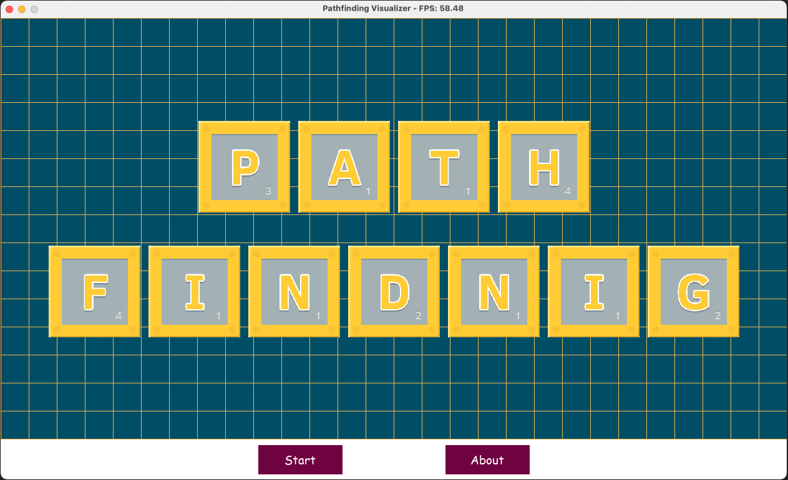
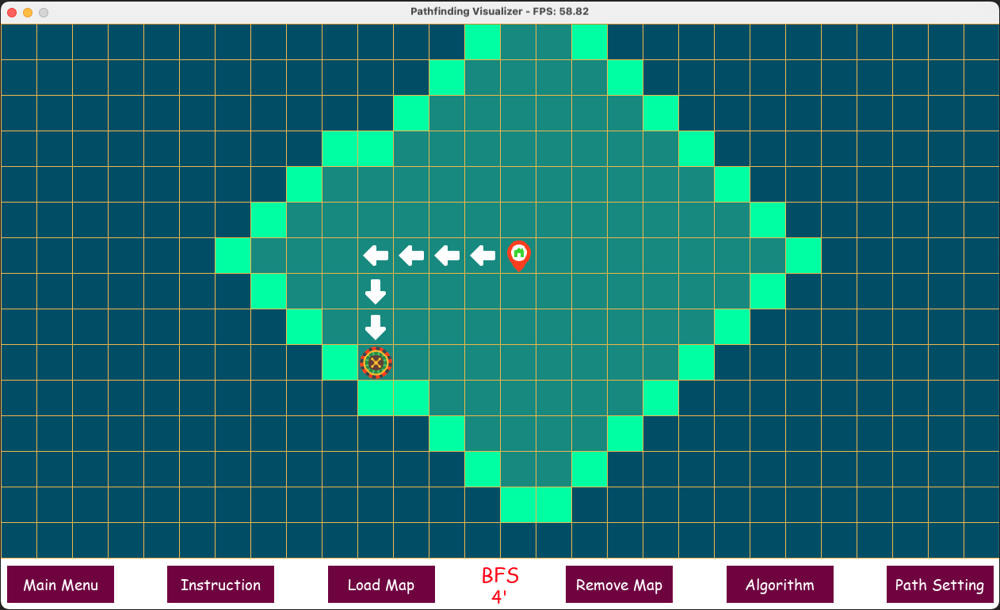
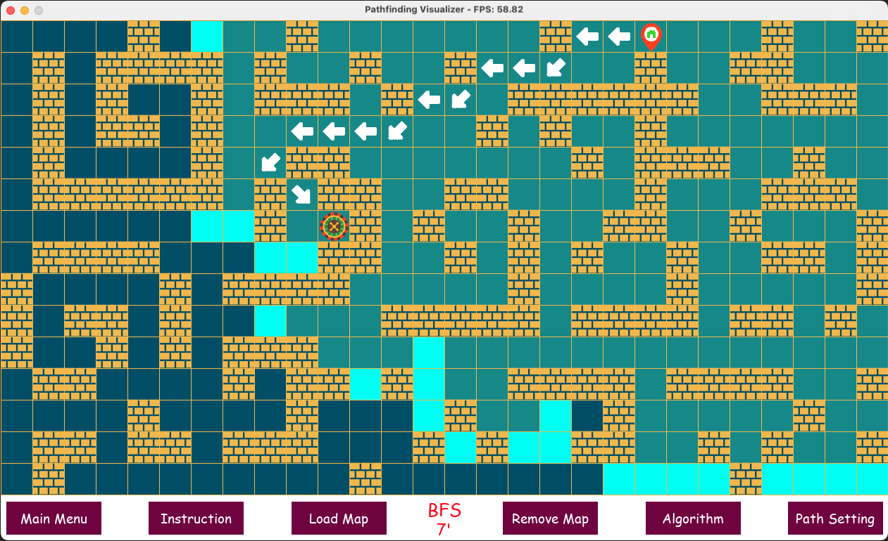

<h1 align="center">Pathfinding Visualizer</h1>

> Developed in [Pygame](https://www.pygame.org/wiki/GettingStarted) (REQUIRED)

<!--  -->
<p align="center">
    
</p>

## Contents

-   [Project Configuration](#1-project-configuration)
-   [Features](#2-features)
-   [Usage](#3-usage)

---

### 1. Project Configuration

-   pygame: 2.5.2

### 2. Features

Visualizes Pathfinding algorithms.

</br>

<p align="center">
    <b>Straight Path</b>
    </br>
    
</p>

</br>

<p align="center">
    <b>Diagonal Path</b>
    </br>
    
</p>

### 3. Usage

To run the project (macOS):

```shell
$ python3 main.py
```